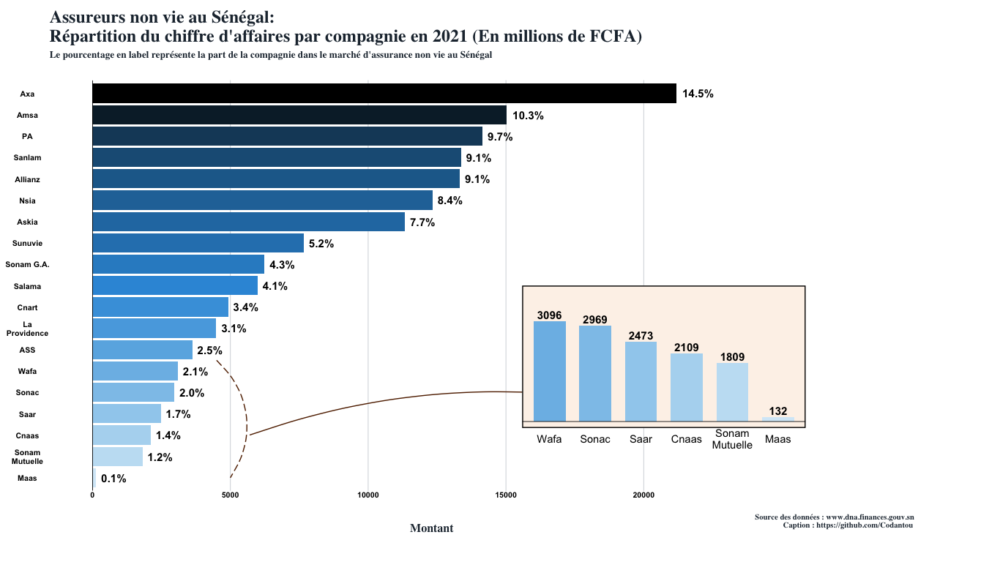
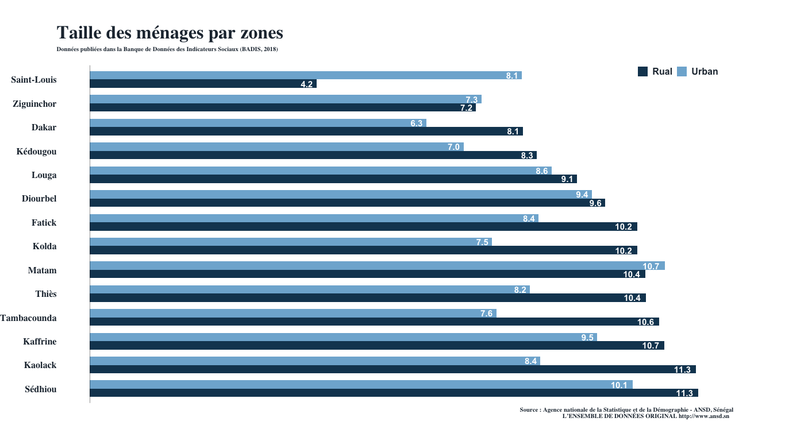
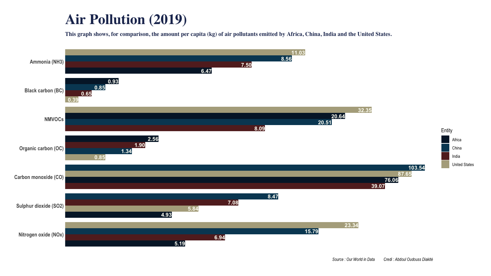
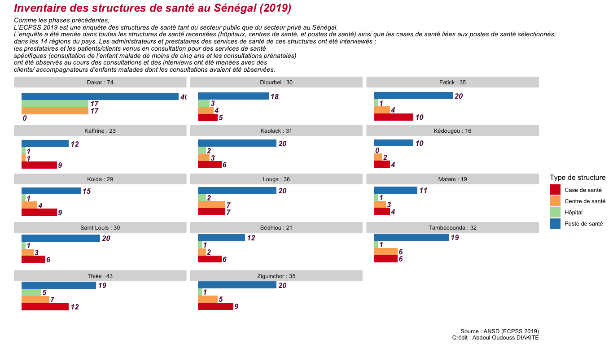
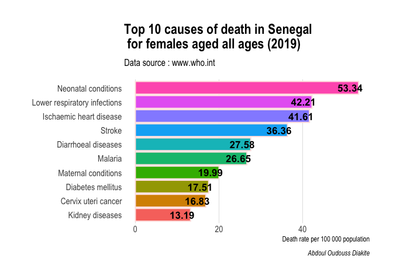
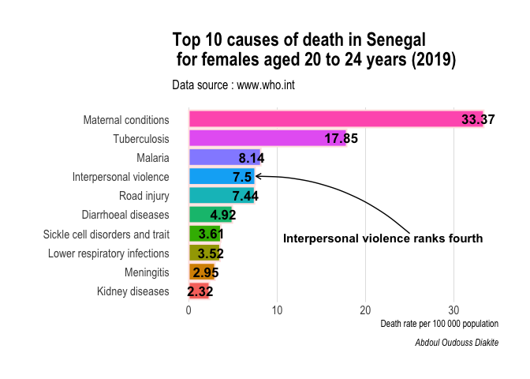
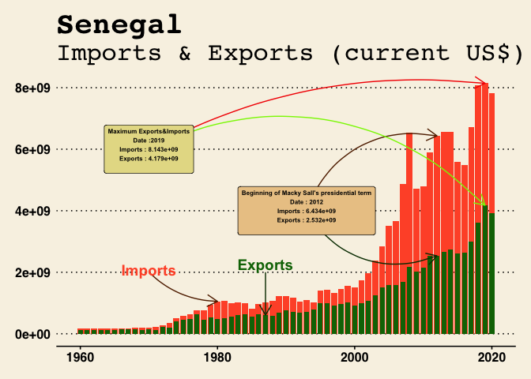
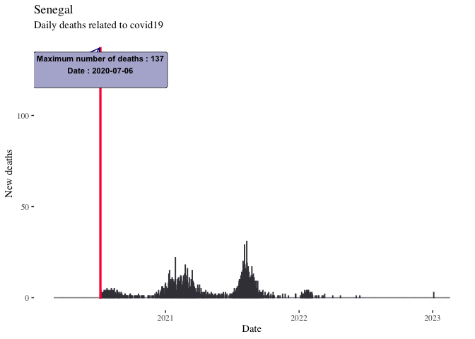

# Assureurs non vie au Sénégal: Répartition du chiffre d'affaires par compagnie en 2021 (En millions de FCFA)

 

# Taille des ménages par zones et par région au Sénégal

 

# Air Pollution (2019)

{width="936"}

# Health facilities

# Causes of deaths

<!-- --><!-- -->

# Expots & Imports (Senegal)

<!-- -->

# Covid 19 ( Senegal )

<!-- --><!-- -->
